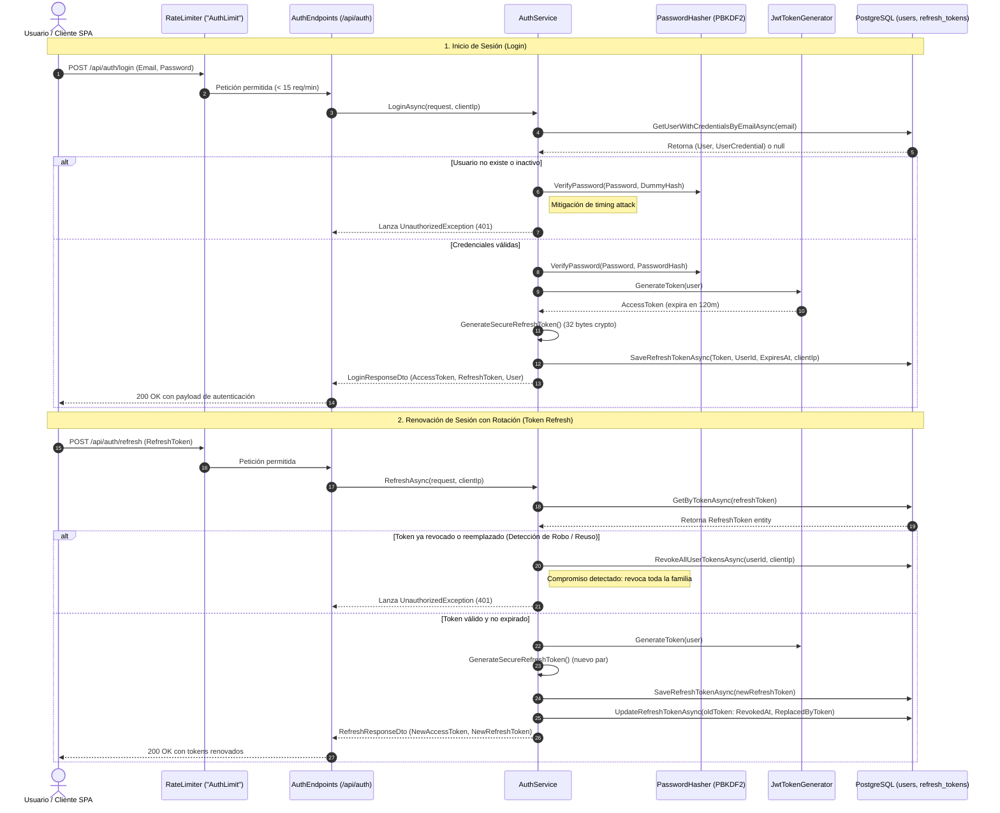
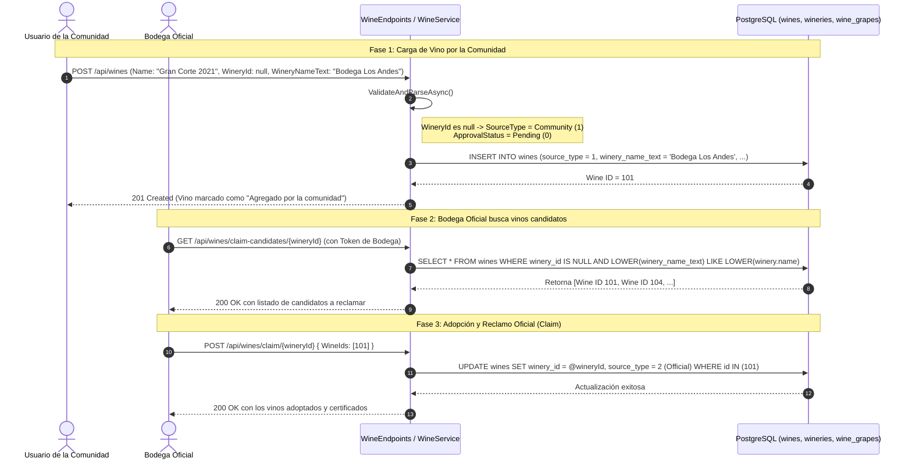
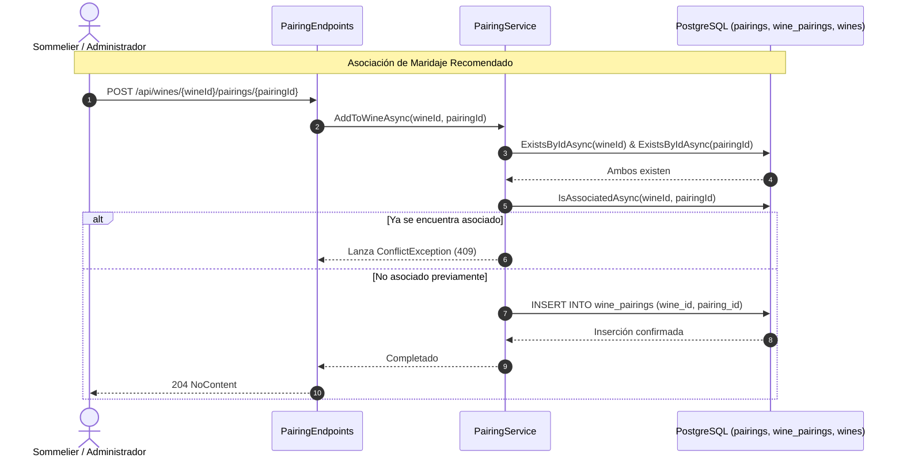
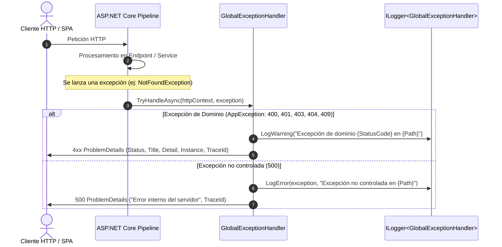

# Flujos de Datos y Secuencia del Sistema - AyVino

Este documento detalla los flujos de datos críticos de AyVino, ilustrando las interacciones entre el cliente SPA, la capa de endpoints, los servicios de dominio, la base de datos PostgreSQL y los componentes transversales.

---

## 1. Flujo de Autenticación y Rotación Segura de Tokens

El sistema utiliza un esquema de autenticación stateless con **Access Tokens JWT** (vida útil: 2 horas) y **Refresh Tokens criptográficos opacos** (vida útil: 7 días) almacenados en PostgreSQL.

### Diagrama de Secuencia: Login y Refresco con Rotación

---

## 2. Flujo de Ciclo de Vida y Reclamo de Vinos (Claim Process)

Este flujo materializa los requisitos funcionales **RF-1.1**, **RF-1.3**, **RF-1.4** y **RF-1.5** ([`spec.md`](../requirements/spec.md)), permitiendo que la comunidad suba botellas y que las bodegas oficiales las adopten formalmente.

---

## 3. Flujo de Asociación Vino-Maridaje

El módulo de maridajes ([`Pairings`](../backend/overview.md)) utiliza una relación N:M mediante la tabla intermedia `wine_pairings` con integridad referencial en cascada.

---

## 4. Flujo de Manejo Global de Excepciones (RFC 7807)

Todas las excepciones lanzadas en cualquier rebanada vertical son interceptadas por el `GlobalExceptionHandler`, garantizando respuestas homogéneas en formato `application/problem+json`:

