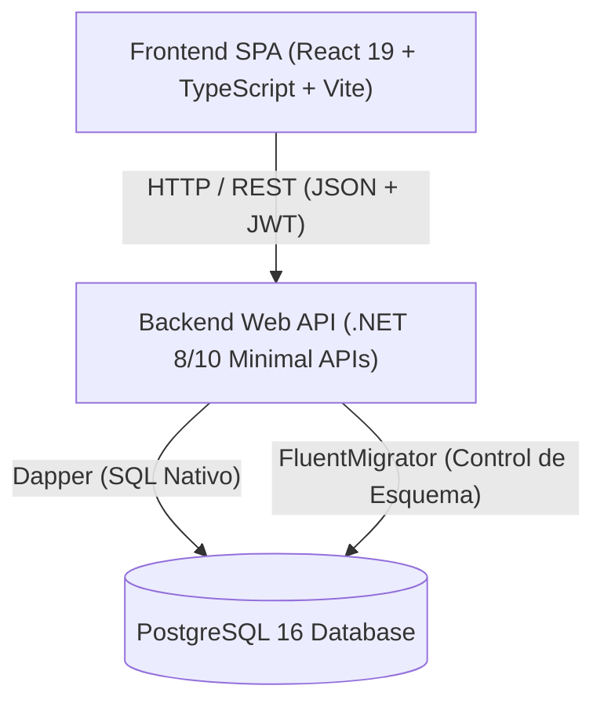

# Arquitectura Global del Sistema - AyVino

## 1. Visión General

**AyVino** es una plataforma social y colaborativa orientada a catalogar, puntuar y comparar vinos. El sistema adopta un modelo **completamente desacoplado cliente-servidor** para garantizar escalabilidad, independencia de despliegue y tipado estricto de punta a punta.



---

## 2. Principios Constitucionales de Arquitectura

Según lo estipulado en la constitución del proyecto ([`AGENTS.md`](file:///c:/Codigo%20General/AyVino/AyVino/AGENTS.md)):

1. **Stack Desacoplado**: Backend en .NET Core (C#) y Frontend independiente en [`src/frontend`](file:///c:/Codigo%20General/AyVino/AyVino/src/frontend).
2. **Base de Datos Estructurada**: Cambios de esquema gobernados exclusivamente mediante `FluentMigrator`. Ningún cambio manual en base de datos.
3. **Calidad y Tipado Estricto**: Cero advertencias de compilador en C# y TypeScript, tipado exhaustivo sin uso de `any`, y manejo global centralizado de excepciones.
4. **Límites de Dominio**: La API nunca expone modelos de base de datos directamente al cliente; todo intercambio de datos se realiza mediante **DTOs** (Data Transfer Objects).
5. **Cobertura de Tests**: Cada funcionalidad incorpora sus respectivos tests en el directorio [`tests`](file:///c:/Codigo%20General/AyVino/AyVino/tests).

---

## 3. Matriz Tecnológica

| Componente | Tecnología | Rol / Justificación |
| :--- | :--- | :--- |
| **Backend Framework** | .NET 8 / 10 Minimal APIs | Alto rendimiento, bajo consumo de memoria y sintaxis concisa para endpoints HTTP. |
| **Acceso a Datos** | Dapper (Micro-ORM) | Ejecución directa de SQL nativo optimizado sin sobrecarga de Entity Framework. |
| **Migraciones** | FluentMigrator | Migraciones versionadas en C# con migraciones hacia adelante y reversiones. |
| **Base de Datos** | PostgreSQL 16 (Docker) | Motor relacional robusto para datos de vinos, usuarios y relaciones complejas. |
| **Frontend Framework**| React 19 + TypeScript | Interfaz moderna, reactiva y tipada estrictamente. |
| **Build Tool & CSS** | Vite + Tailwind CSS v4 | Compilación instantánea, HMR ultrarrápido y sistema de diseño editorial moderno. |
| **Autenticación** | JWT + Refresh Tokens | Seguridad stateless con tokens de corta duración y refresh seguro almacenado en base de datos. |

---

## 4. Estructura de la Solución

```text
AyVino/
├── AyVino.slnx                    # Archivo de solución .NET
├── compose.yml                    # Contenedor de PostgreSQL 16 local
├── docs/                          # Documentación viva y centralizada del proyecto
├── src/
│   ├── backend/
│   │   ├── AyVino.Api/            # Proyecto Web API principal (Vertical Slices)
│   │   └── AyVino.Core/           # Librería de utilidades de dominio base
│   └── frontend/                  # Proyecto SPA (React 19 + TypeScript)
└── tests/
    └── AyVino.UnitTests/          # Pruebas unitarias y de integración
```

