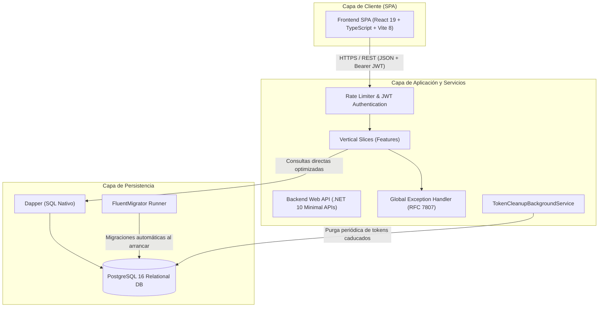

# Arquitectura Global del Sistema - AyVino

## 1. Visión General

**AyVino** es una plataforma colaborativa y social concebida para catalogar, calificar, reseñar y comparar vinos, conectando a la comunidad de consumidores y sommeliers con las bodegas productoras oficiales.

El sistema se rige bajo un modelo **cliente-servidor estrictamente desacoplado**. El backend expone una API RESTful de alto rendimiento en C# (.NET 10), mientras que el frontend opera como una Single Page Application (SPA) en React 19 optimizada para una experiencia de usuario interactiva y fluida.


```mermaid
graph TD
    subgraph ClientLayer["Capa de Cliente (SPA)"]
        SPA["Frontend SPA (React 19 + TypeScript + Vite 8)"]
    end

    subgraph ApiLayer["Capa de Aplicación y Servicios"]
        API["Backend Web API (.NET 10 Minimal APIs)"]
        AuthMid["Rate Limiter & JWT Authentication"]
        ExMid["Global Exception Handler (RFC 7807)"]
        Slices["Vertical Slices (Features)"]
        BGService["TokenCleanupBackgroundService"]
    end

    subgraph DataLayer["Capa de Persistencia"]
        Dapper["Dapper (SQL Nativo)"]
        Migrator["FluentMigrator Runner"]
        PG[("PostgreSQL 16 Relational DB")]
    end

    SPA -->|"HTTPS / REST (JSON + Bearer JWT)"| AuthMid
    AuthMid --> Slices
    Slices --> ExMid
    Slices -->|"Consultas directas optimizadas"| Dapper
    Dapper --> PG
    Migrator -->|"Migraciones automáticas al arrancar"| PG
    BGService -->|"Purga periódica de tokens caducados"| PG
```

---

## 2. Principios Constitucionales de Arquitectura

En concordancia con la constitución del proyecto ([`AGENTS.md`](../../AGENTS.md)):

1. **Stack Desacoplado**: El backend en .NET Core (C#) y el frontend en [`src/frontend/`](../../src/frontend) mantienen ciclos de vida, dependencias y despliegues completamente independientes.
2. **Base de Datos Estructurada**: Los cambios de esquema están gobernados exclusivamente por migraciones versionadas y bidireccionales (`Up`/`Down`) en `FluentMigrator`. Queda prohibido cualquier DDL manual sin versionar.
3. **Calidad y Tipado Estricto**: Cero advertencias de compilador en C# y TypeScript, tipado riguroso sin uso de `any`, y serialización homogénea de excepciones bajo el estándar RFC 7807.
4. **Límites de Dominio y DTOs**: La API jamás expone modelos o entidades de base de datos directamente al cliente; todo intercambio de información se realiza a través de DTOs (Data Transfer Objects) inmutables.
5. **Cobertura de Pruebas**: Cada funcionalidad incorpora sus respectivos tests en el directorio [`tests/`](../../tests).
6. **Documentación Viva**: Cualquier endpoint, cambio de esquema o componente nuevo debe reflejarse en `docs/` como requisito de la Definición de Terminado (DoD).

---

## 3. Matriz Tecnológica

| Componente | Tecnología | Rol / Justificación Arquitectural |
| :--- | :--- | :--- |
| **Backend Framework** | .NET 10 / C# 13 (Minimal APIs) | Máxima eficiencia de CPU y memoria, reducción drástica de boilerplate respecto a MVC clásico y pipeline HTTP optimizado. |
| **Acceso a Datos** | Dapper (Micro-ORM) | Ejecución directa de SQL nativo optimizado con mapeo tipado de alto rendimiento, evitando el overhead y la complejidad del change-tracking de EF Core. |
| **Control de Esquema** | FluentMigrator (PostgreSQL) | Migraciones escritas en C# fuertemente tipado, con soporte transaccional y rollback garantizado. |
| **Base de Datos** | PostgreSQL 16 Alpine | Motor relacional robusto para relaciones complejas (blends de uva, jerarquía territorial, relaciones N:M de maridajes). |
| **Frontend Framework**| React 19 + TypeScript 5.8 | Interfaz reactiva moderna, concurrencia nativa, tipado estricto y separación modular de componentes. |
| **Herramientas de Build** | Vite 8 + `@tailwindcss/vite` | HMR ultrarrápido en desarrollo, empaquetado optimizado para producción y estilos basados en utilidades modernas. |
| **Autenticación** | JWT + Refresh Tokens Rotativos | Modelo stateless con tokens de acceso de corta duración (2 horas) y refresh tokens criptográficos almacenados en base de datos con detección de reutilización y revocación de familia. |
| **Criptografía** | PBKDF2 (HMAC-SHA256) | Hashing seguro de contraseñas con sal aleatoria de 16 bytes e incorporación de `DummyHash` para neutralizar ataques de temporización (timing attacks). |
| **Documentación API** | Scalar API Reference + Microsoft.AspNetCore.OpenApi | Renderizado moderno y navegable de la especificación OpenAPI v3 en `/scalar/v1`. |

---

## 4. Decisiones Técnicas Principales (ADRs)

### ADR-01: Adopción de Vertical Slice Architecture

- **Contexto**: Las arquitecturas por capas técnicas (Clean Architecture tradicional, Onion) separan el código horizontalmente en carpetas como `Controllers`, `Services`, `Repositories` y `Entities`. Cuando una funcionalidad cambia, el desarrollador debe editar archivos en cuatro proyectos o carpetas diferentes, generando acoplamiento innecesario entre casos de uso independientes.
- **Decisión**: Se implementa **Vertical Slice Architecture**. El código se organiza dentro de [`src/backend/AyVino.Api/Features/`](../../src/backend/AyVino.Api/Features) agrupado por rebanada de negocio (`Auth`, `Users`, `Wineries`, `Locations`, `Grapes`, `Wines`, `Pairings`).
- **Consecuencias**: Alta cohesión interna, bajo acoplamiento entre funcionalidades, facilidad para refactorizar o eliminar un slice sin afectar al resto del sistema, y trazabilidad inmediata de cada caso de uso.

### ADR-02: Micro-ORM Dapper sobre Entity Framework Core

- **Contexto**: AyVino requiere consultas específicas con agregaciones, filtros dinámicos multicriterio (bodega, varietal, rango de años) y joins eficientes para cortes de uva y maridajes.
- **Decisión**: Se selecciona **Dapper** en lugar de Entity Framework Core.
- **Consecuencias**: SQL explícito y transparente sin sorpresas de generación de consultas (`N+1` o joins inesperados), menor consumo de memoria y compatibilidad directa con las funciones avanzadas de PostgreSQL.

### ADR-03: Rotación Estricta de Refresh Tokens y Detección de Robo

- **Contexto**: La autenticación basada únicamente en JWT de larga duración expone a los usuarios a riesgos de secuestro de token.
- **Decisión**: Se implementa un esquema de **Access Token de corta duración (120 min) + Refresh Token rotativo (7 días)**. Cada vez que se utiliza un Refresh Token, este es invalidado y reemplazado por un nuevo par. Si el sistema detecta que un token ya revocado intenta refrescarse, se asume un intento de secuestro de sesión y se revocan inmediatamente **todos los tokens activos de la familia del usuario**, obligándolo a iniciar sesión nuevamente.
- **Consecuencias**: Máxima seguridad en sesiones activas, auditoría de IP de creación y revocación, y limpieza en segundo plano con `TokenCleanupBackgroundService`.

### ADR-04: Modelo Dual de Catálogo y Proceso de Reclamo (Claiming)

- **Contexto**: Un catálogo exclusivo de bodegas oficiales generaría barreras de entrada iniciales, mientras que un catálogo 100% comunitario provocaría dispersión y baja calidad de datos.
- **Decisión**: Los usuarios pueden cargar botellas comunitarias (`SourceType = Community`). Cuando una bodega productora se registra oficialmente en la plataforma, tiene a su disposición un flujo de reclamo (`GET /api/wines/claim-candidates/{wineryId}` y `POST /api/wines/claim/{wineryId}`) para asociar las botellas comunitarias a su entidad oficial (`SourceType = Official`), unificando el catálogo sin perder las interacciones históricas.

---

## 5. Estructura de la Solución

```text
AyVino/
├── AyVino.slnx                    # Archivo de solución moderna para .NET
├── compose.yml                    # Contenedor de PostgreSQL 16 local
├── docs/                          # Documentación viva y centralizada del proyecto
├── src/
│   ├── backend/
│   │   ├── AyVino.Api/            # Proyecto Web API principal (Vertical Slices)
│   │   └── AyVino.Core/           # Librería base para utilidades compartidas
│   └── frontend/                  # Proyecto SPA (React 19 + TypeScript + Vite)
└── tests/
    └── AyVino.UnitTests/          # Pruebas unitarias y de integración
```
