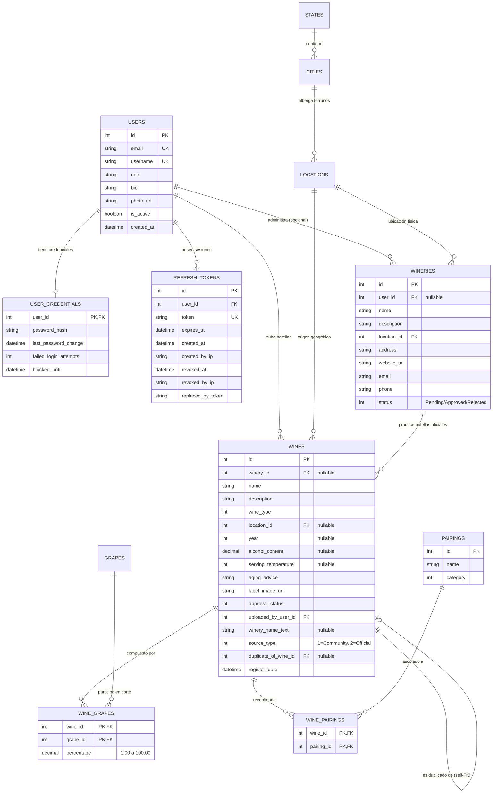

# Migraciones de Base de Datos - FluentMigrator

En cumplimiento de la constitución del proyecto ([`AGENTS.md`](../../AGENTS.md)):
> **Base de Datos**: Cambios de esquema estructurados únicamente mediante `FluentMigrator`.

---

## 1. Convenciones y Estructura

Las migraciones residen en [`src/backend/AyVino.Api/Migrations/`](../../src/backend/AyVino.Api/Migrations) y heredan de la clase base `Migration` de FluentMigrator.

Cada clase está decorada con el atributo `[Migration(version)]` donde la versión sigue el timestamp `YYYYMMDDNNN`. Toda migración es estrictamente bidireccional, implementando tanto `Up()` (aplicar cambios) como `Down()` (revertir cambios con eliminación ordenada de claves foráneas e índices).

---

## 2. Catálogo Completo de Migraciones

| Versión | Archivo de Migración | Tablas / Objetos Afectados | Descripción y Reglas de Negocio |
| :--- | :--- | :--- | :--- |
| `202603200001` | `CreateUsersTable.cs` | `users`, `user_credentials` | Creación de perfiles de usuario (roles: `User`, `Winery`, `Admin`) y credenciales desacopladas (hash PBKDF2, intentos fallidos y bloqueo temporal). |
| `202603200002` | `CreateRefreshTokensTable.cs` | `refresh_tokens` | Almacenamiento seguro de tokens de refresco, tracking de IP de creación/revocación, enlace de rotación (`replaced_by_token`) y auditoría. |
| `202603200003` | `CreateWineriesTable.cs` | `wineries` | Catálogo de bodegas con estado (`Pending`, `Approved`, `Rejected`) y relación nullable `user_id` con `users` (soporta bodegas comunitarias sin dueño y bodegas oficiales). |
| `202603200004` | `CreateGrapesTable.cs` | `grapes` | Variedades de uva y cepas con tipado por color (`color_type`: Tinto, Blanco, Rosado). |
| `20260809001` | `CreateStatesTable.cs` | `states` | Tabla base para provincias argentinas (id, name). |
| `20260809002` | `SeedStates.cs` | `states` | Carga inicial (seed) de las 24 jurisdicciones de Argentina (Mendoza, San Juan, Salta, Río Negro, La Rioja, etc.). |
| `20260809003` | `CreateCitiesTable.cs` | `cities` | Ciudades y departamentos vitivinícolas con clave foránea a `states` y estado de moderación (`status`). |
| `20260809004` | `CreateLocationsTable.cs` | `locations` | Terruños y zonas específicas de producción con clave foránea a `cities`. |
| `20260830002` | `CreateWinesTable.cs` | `wines`, `wine_grapes` | Ficha técnica del vino (año, graduación alcohólica, temperatura de servicio, notas de estiba, estado de moderación) y tabla intermedia `wine_grapes` con clave compuesta y constraint `CK_WineGrapes_Percentage` (porcentaje entre 1 y 100). |
| `20260830003` | `AddWineClaimFields.cs` | `wines` | Incorpora soporte para el flujo de reclamo (Pieza B y C): columna `winery_name_text` (nombre ingresado por la comunidad), `source_type` (1=Community, 2=Official) y `duplicate_of_wine_id` (self-FK para merge de duplicados). |
| `20260919001` | `CreatePairingsTable.cs` | `pairings`, `wine_pairings` | Catálogo de maridajes culinarios clasificados por categoría y tabla intermedia de asociación N:M `wine_pairings` con eliminación en cascada. |

---

## 3. Diagrama Entidad-Relación (ERD)



---

## 4. Ejecución y Ciclo de Vida en Arranque

FluentMigrator se ejecuta automáticamente al iniciar la API en `Program.cs`:

```csharp
using (var scope = app.Services.CreateScope())
{
    var runner = scope.ServiceProvider.GetRequiredService<IMigrationRunner>();
    try {
        runner.MigrateUp();
    }
    catch (Exception ex)
    {
        var logger = scope.ServiceProvider.GetRequiredService<ILogger<Program>>();
        logger.LogCritical(ex, "Error crítico durante la ejecución de las migraciones de base de datos.");
        throw;
    }
}
```

### Reglas para Nuevas Migraciones

1. **Nunca alterar migraciones ya aplicadas**: Si se requiere un cambio sobre una tabla existente, crear una nueva clase de migración con versión incremental.
2. **Reversibilidad total**: Todo método `Up()` debe tener su contraparte exacta en `Down()` eliminando foreign keys, índices y constraints antes de borrar tablas.
3. **Restricciones e Índices Explícitos**: Agregar siempre índices sobre columnas utilizadas en cláusulas `WHERE` o `JOIN` (ej: `winery_id`, `location_id`, `winery_name_text`).
