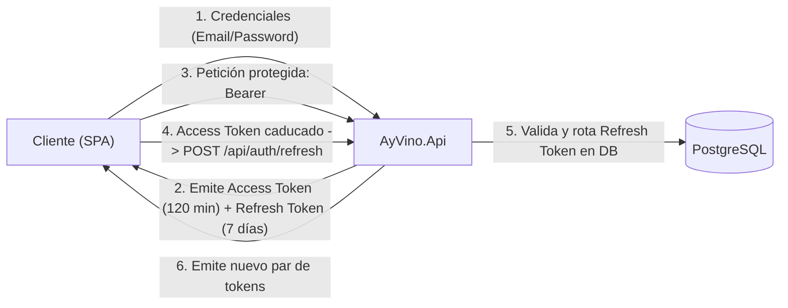

# Protocolos de Seguridad y Autenticación - AyVino.Api

Este documento detalla los mecanismos criptográficos, esquemas de autorización, mitigación de vectores de ataque y políticas de rate limiting implementadas en el backend de AyVino.

---

## 1. Esquema de Doble Token (Access Token + Refresh Token)

Para ofrecer una experiencia de usuario fluida sin sacrificar la seguridad de las sesiones, AyVino implementa un modelo de **doble token**:



### 1.1 Access Token JWT (JSON Web Token)
- **Vida útil**: 120 minutos (`Jwt:ExpirationMinutes`).
- **Algoritmo de firma**: HMAC-SHA256 (`SecurityAlgorithms.HmacSha256`).
- **Validación de Claims en Pipeline**:
  - `ValidateIssuerSigningKey = true`
  - `ValidateIssuer = true`
  - `ValidateAudience = true`
  - `ValidateLifetime = true`
  - `ClockSkew = TimeSpan.Zero` (tolerancia cero a discrepancias temporales).
- **Claims Tipados**:
  - `ClaimTypes.NameIdentifier` (`sub`): Identificador numérico del usuario (`user.Id`).
  - `ClaimTypes.Email`: Correo electrónico normalizado (`user.Email`).
  - `ClaimTypes.Name`: Nombre de usuario (`user.Username`).
  - `ClaimTypes.Role`: Rol asignado (`user.Role` -> `User`, `Winery`, `Admin`).

### 1.2 Refresh Token Criptográfico y Rotación
- **Vida útil**: 7 días (`Jwt:RefreshTokenExpirationDays`).
- **Generación**: Generador de números aleatorios criptográficamente seguro (`RandomNumberGenerator.GetBytes(32)` serializado en Base64).
- **Rotación en cada refresco**: Cada vez que el cliente invoca `/api/auth/refresh`, el token actual se marca con `revoked_at = UtcNow` y se enlaza al nuevo token generado mediante `replaced_by_token`.
- **Detección de Reutilización (Token Theft Detection)**:
  Si un atacante y la víctima intentan usar el mismo Refresh Token:
  1. Si un token ya revocado es presentado en `/api/auth/refresh`, el sistema detecta de inmediato el compromiso de la sesión.
  2. Se invoca `RevokeAllUserTokensAsync(userId)` revocando en cascada **todos los tokens activos de la familia del usuario**.
  3. Se interrumpe la sesión y se fuerza a reautenticarse mediante credenciales.

---

## 2. Criptografía de Contraseñas y Mitigación de Timing Attacks

La gestión de contraseñas reside en [`PasswordHasher.cs`](../../src/backend/AyVino.Api/Common/Security/Hashing/PasswordHasher.cs):

### 2.1 Algoritmo PBKDF2
- **Función pseudoaleatoria**: HMAC-SHA256.
- **Factor de trabajo**: 100,000 iteraciones.
- **Sal (Salt)**: 16 bytes generados con entropía criptográfica (`RandomNumberGenerator`).
- **Formato almacenado**: `{iterations}.{saltBase64}.{hashBase64}`.

### 2.2 Mitigación de Ataques de Temporización (Timing Attacks)
Cuando un atacante intenta adivinar qué correos existen en el sistema midiendo el tiempo de respuesta:
- Si el usuario no existe en la base de datos, el flujo habitual retornaría inmediatamente en pocos milisegundos, delatando la no existencia del usuario.
- En `AuthService.cs`:
  ```csharp
  if (user is null || credential is null)
  {
      passwordHasher.VerifyPassword(request.Password, passwordHasher.DummyHash);
      throw new UnauthorizedException("Credenciales inválidas.");
  }
  ```
  El sistema ejecuta deliberadamente las 100,000 iteraciones de PBKDF2 contra un hash sintético (`DummyHash`), igualando el tiempo de respuesta de usuarios existentes y no existentes.

---

## 3. Rate Limiting (`AuthLimit`)

Para prevenir ataques de fuerza bruta en los endpoints de autenticación (`/api/auth/login` y `/api/auth/refresh`), se aplica un limitador de ventana fija en `Program.cs`:

- **Algoritmo**: `FixedWindowRateLimiter`.
- **Límite**: 15 peticiones permitidas por minuto por dirección IP remota.
- **Respuesta ante exceso**: Código HTTP `429 Too Many Requests`.

---

## 4. Servicio en Segundo Plano: Purga de Tokens

Para evitar el crecimiento indefinido de la tabla `refresh_tokens`, se registra el hosted service [`TokenCleanupBackgroundService.cs`](../../src/backend/AyVino.Api/Features/Auth/Services/TokenCleanupBackgroundService.cs):

- **Frecuencia de ejecución**: Cada 1 hora.
- **Criterio de purga**: Elimina físicamente registros donde `expires_at < UtcNow - 30 días` o tokens revocados hace más de 30 días.
- **Manejo de errores**: Las excepciones durante la purga son registradas en el logger sin interrumpir el funcionamiento de la API.

---

## 5. Políticas y Roles de Autorización

El sistema define 3 roles canónicos en [`AppRoles.cs`](../../src/backend/AyVino.Api/Common/Constants/AppRoles.cs):
1. **`AppRoles.Admin` ("Admin")**: Acceso irrestricto, moderación de bodegas, ciudades y vinos, y administración de usuarios.
2. **`AppRoles.User` ("User")**: Aficionado o sommelier de la comunidad. Puede subir botellas comunitarias, gestionar su perfil y agregar maridajes.
3. **`AppRoles.Winery` ("Winery")**: Bodega oficial. Puede publicar etiquetas oficiales, actualizar su perfil institucional y reclamar vinos de la comunidad coincidentes.

Mapeados a políticas en `Program.cs`:
- `AppPolicies.RequireAdmin` -> `RequireRole(AppRoles.Admin)`
- `AppPolicies.RequireUser` -> `RequireRole(AppRoles.User)`
- `AppPolicies.RequireWinery` -> `RequireRole(AppRoles.Winery)`

---

## 6. Gestión Segura de Secretos y Configuración JWT

Para evitar la fuga de credenciales en repositorios públicos, **ninguna clave ni contraseña debe ser versionada en `appsettings.json`**.

### 6.1 Desarrollo Local: `dotnet user-secrets`
El secreto criptográfico para la firma de tokens JWT (`Jwt:SecretKey`) debe poseer un mínimo de 32 caracteres (256 bits) y se gestiona fuera del control de versiones:

```bash
# Inicializar y configurar el secreto local en la máquina del desarrollador:
dotnet user-secrets set "Jwt:SecretKey" "TuClaveSecretaDeDesarrolloMin32Bytes!" --project src/backend/AyVino.Api/AyVino.Api.csproj
```

### 6.2 Entornos Productivos / CI-CD: Variables de Entorno
En servidores de despliegue, Docker o plataformas en la nube, se configuran mediante variables de entorno estándar de ASP.NET Core:
- `Jwt__SecretKey`: Clave criptográfica HMAC-SHA256 de alta entropía.
- `ConnectionStrings__DefaultConnection`: Cadena de conexión hacia PostgreSQL.


