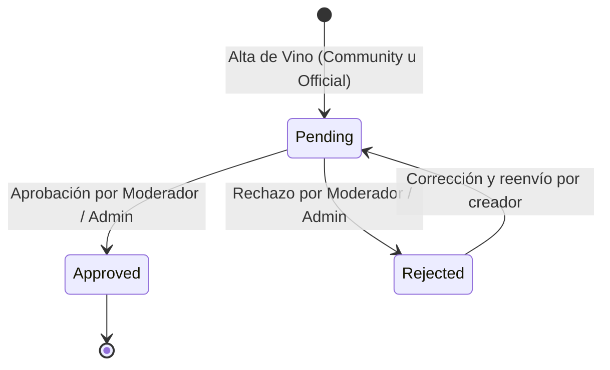
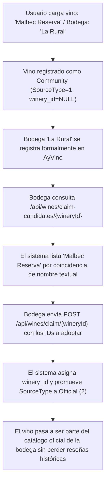

# Ciclo de Vida del Vino, Cortes y Reclamo Oficial - AyVino.Api

Este documento describe las reglas de negocio del dominio vitivinícola en AyVino: procedencia de botellas, estados de moderación, formulación de cortes de uva (blends) y el protocolo de adopción o reclamo de vinos por bodegas oficiales.

---

## 1. Procedencia y Tipos de Origen (`SourceType`)

Cada vino en el catálogo posee un origen explícito que define su grado de certificación institucional:

| Valor Enumérico | Identificador | Creador Típico | Características |
| :---: | :--- | :--- | :--- |
| `1` | `SourceType.Community` | Usuario / Aficionado | Creado cuando no se especifica una bodega oficial registrada (`winery_id IS NULL`). El usuario ingresa el nombre de la bodega en el campo textual `winery_name_text`. Se muestra con la etiqueta pública *"Agregado por la comunidad"*. |
| `2` | `SourceType.Official` | Bodega Verificada / Reclamo | Creado directamente por una bodega con cuenta oficial en la plataforma o promovido tras un proceso de reclamo exitoso (`claim`). |

---

## 2. Estados de Moderación (`WineApprovalStatus`)

Todo vino nuevo ingresa con estado inicial `Pending` para garantizar la calidad del catálogo:

- **`0 = Pending`**: El vino fue creado y está a la espera de revisión editorial o verificación de datos.
- **`1 = Approved`**: El vino es visible en búsquedas públicas y listados generales.
- **`2 = Rejected`**: El vino no cumple con los estándares mínimos de calidad (ej. datos apócrifos o duplicados manifiestos).

---

## 3. Cortes de Uva y Composición Varietal (Blends)

AyVino modela la enología real permitiendo tanto varietales puros (100% de una cepa) como cortes multivarietales (blends).

### Reglas de Validación de Dominio:
1. **Existencia de Cepas**: Cada `GrapeId` provisto en el corte debe existir previamente en el catálogo de `grapes`.
2. **Restricción de Porcentaje (`CK_WineGrapes_Percentage`)**:
   - Todo porcentaje individual debe ser estrictamente mayor a `0` y menor o igual a `100.00%`.
   - La suma total de los porcentajes especificados en el blend no puede exceder el `100.00%`.
3. **Persistencia Transaccional**:
   Al crear o actualizar un vino (`WineRepository.CreateAsync` / `UpdateAsync`), la inserción en la tabla `wine_grapes` se efectúa dentro de la misma transacción física, garantizando atomicidad.

---

## 4. El Proceso de Reclamo Oficial (Wine Claim Flow)

Para resolver el problema del contenido generado por usuarios antes de que una bodega se sume a la plataforma, se implementa el flujo de reclamo ([RF-1.5](../requirements/spec.md)):

### Endpoints Intervinientes:
- **`GET /api/wines/claim-candidates/{wineryId}`**:
  Busca vinos con `winery_id IS NULL` y cuyo `winery_name_text` coincida fonética o textualmente (`ILIKE`) con el nombre de la bodega registrada.
- **`POST /api/wines/claim/{wineryId}`**:
  Recibe un `ClaimWinesRequestDto` con la lista de `WineIds`. Actualiza la columna `winery_id` y conmuta `source_type = SourceType.Official`.

---

## 5. Fundamentos para Deduplicación y Merge (Pieza C)

La migración `20260830003_AddWineClaimFields` incorporó la columna autoverificable `duplicate_of_wine_id` con foreign key recursiva a la misma tabla `wines`.

Esto sienta las bases para consolidar vinos idénticos cargados por múltiples usuarios:
- Un vino duplicado puede apuntar a su vino canónico (`duplicate_of_wine_id = original_wine_id`).
- Las calificaciones y reseñas se reasignan al vino maestro mediante cascada lógica, preservando el feedback de la comunidad sin saturar el catálogo.

