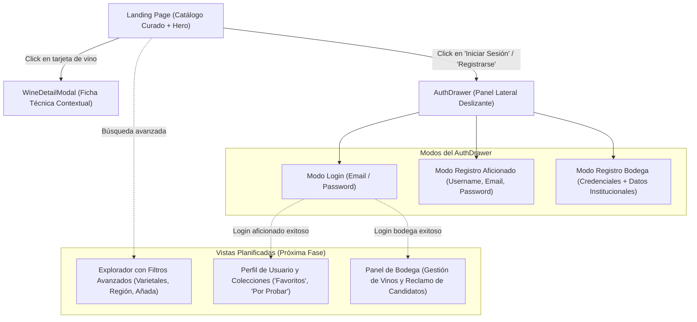

# Mapa de Navegación y Flujo de Usuario - AyVino Frontend

Este documento detalla la arquitectura de información, las vistas de la aplicación y la experiencia interactiva (UX) del usuario en la SPA de AyVino.

---

## 1. Diagrama de Navegación de Vistas

---

## 2. Pantallas y Componentes Interactivos

### 2.1 Página de Inicio (`Landing.tsx`)
- **Sección Hero**:
  - Título editorial de alto impacto (*"Descubrí, puntuá y compartí tu pasión por el buen vino"*).
  - Barra de búsqueda rápida de etiquetas, varietales y bodegas.
  - Llamados a la acción directos para explorar el catálogo o iniciar sesión.
- **Grilla de Vinos Curados**:
  - Renderizado de tarjetas de vino (`WineCard.tsx`).
  - Badges distintivos: Puntuación de cata (ej: `94 pts`), Origen geográfico (`Mendoza, Argentina`), Varietal dominante (`Malbec`) y Estado de origen (*"Oficial"* vs *"Comunidad"*).

### 2.2 Ficha Técnica en Modal (`WineDetailModal.tsx`)
Al presionar una tarjeta, se abre un modal contextual con fondo oscurecido (`backdrop-blur-sm`) que exhibe:
- Representación visual de la botella y etiqueta (`WineBottleMock.tsx`).
- Datos técnicos: Añada (cosecha), graduación alcohólica, temperatura recomendada de servicio y notas de estiba.
- Composición de uvas (Blend / Corte) con porcentajes detallados.
- Maridajes sugeridos (carnes rojas, pastas, quesos maduros, etc.).
- Botones de acción rápida: Guardar en *"Favoritos"*, *"Por Probar"* o calificar.

### 2.3 Cajón Lateral de Autenticación (`AuthDrawer.tsx`)
En lugar de redirigir al usuario a una página aislada o bloquear la pantalla con un modal agresivo, la autenticación se despliega como un panel deslizante desde el lateral derecho:
1. **Pestaña de Inicio de Sesión**: Validación de correo electrónico y contraseña, enlace a recuperación.
2. **Pestaña de Registro de Aficionado**: Creación rápida de cuenta con rol de usuario estándar para interactuar con la comunidad.
3. **Pestaña de Registro de Bodega**: Formulario especializado de onboarding que recopila los datos del responsable y la información institucional de la bodega (nombre, región vitivinícola, sitio web y contacto) para emitir el perfil oficial y la sesión JWT en un único paso.

---

## 3. Próximos Flujos en Desarrollo

- **Explorador y Filtro Multicriterio**:
  Integración directa con `GET /api/wines` admitiendo filtros combinados por `wineryId`, `grapeId`, `yearFrom` y `yearTo`.
- **Flujo de Reclamo en Dashboard de Bodega**:
  Interfaz dedicada donde el sommelier o administrador de la bodega puede visualizar los vinos candidatos detectados por el sistema (`GET /api/wines/claim-candidates/{wineryId}`) y adoptarlos con un solo click (`POST /api/wines/claim/{wineryId}`).
