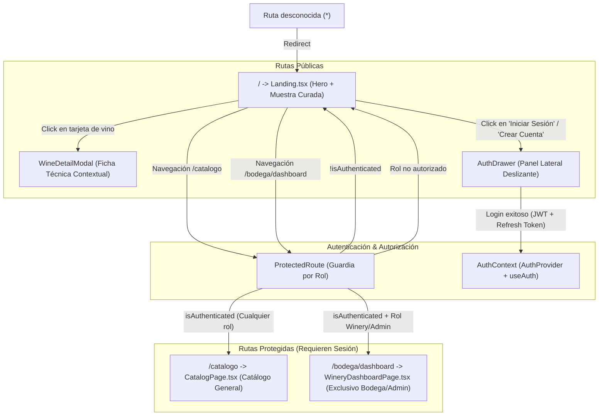

# Mapa de Navegación y Flujo de Usuario - AyVino Frontend

Este documento detalla la arquitectura de información, las vistas de la aplicación, el sistema de rutas protegidas y la experiencia interactiva (UX) del usuario en la SPA de AyVino.

---

## 1. Diagrama de Navegación y Guardias de Ruta

---

## 2. Pantallas y Componentes Interactivos

### 2.1 Página de Inicio (`Landing.tsx`)
- **Sección Hero**:
  - Título editorial de alto impacto (*"Tu bodega personal, organizada copa a copa"*).
  - Acciones rápidas para explorar la selección curada o ingresar al sistema.
- **Grilla de Vinos Curados**:
  - Renderizado de tarjetas de vino ([`WineCard.tsx`](../../src/frontend/src/features/wines/components/WineCard.tsx)).
  - Badges de puntuación, notas de cata sensoriales, procedencia (*"Oficial"* vs *"Comunidad"*) y precio orientativo.
- **Modal de Ficha Técnica** ([`WineDetailModal.tsx`](../../src/frontend/src/features/wines/components/WineDetailModal.tsx)):
  - Visualización 3D simulada de la botella ([`WineBottleMock.tsx`](../../src/frontend/src/features/wines/components/WineBottleMock.tsx)).
  - Desglose técnico: añada, notas de cata completas, maridajes y características de terroir.

### 2.2 Cajón Lateral de Autenticación (`AuthDrawer.tsx`)
- Panel deslizante derecho que preserva el contexto de lectura.
- **Modo Inicio de Sesión**:
  - Envío reactivo a `POST /api/auth/login` mediante [`loginApi`](../../src/frontend/src/features/auth/api/authApi.ts).
  - Manejo integral de errores con alertas visuales:
    - `401 Unauthorized`: Feedback de credenciales incorrectas.
    - `429 Rate Limit`: Advertencia de exceso de intentos fallidos.
- **Modo Registro**:
  - Formulario de alta para sumarse a la comunidad vitivinícola.

### 2.3 Barra de Navegación Contextual (`Navbar.tsx`)
- Integración con React Router (`<Link>`) y reactiva al estado global de [`useAuth()`](../../src/frontend/src/features/auth/context/AuthContext.tsx):
  - **Estado Anónimo**: Exhibe enlaces de sección y botones *"Iniciar Sesión"* y *"Crear Cuenta"*.
  - **Estado Autenticado**:
    - Píldora con nombre de usuario y badge de rol (`User`, `Winery`, `Admin`).
    - Enlace al Catálogo Protegido (`/catalogo`).
    - Enlace al Panel de Bodega (`/bodega/dashboard`) únicamente visible para roles `Winery` y `Admin`.
    - Botón de cierre de sesión (*"Salir"* / *"Cerrar Sesión"*), con revocación remota en backend y reseteo local.

---

## 3. Vistas Protegidas y Políticas de Acceso

| Ruta | Componente | Acceso Permitido | Comportamiento si no cumple |
| :--- | :--- | :--- | :--- |
| `/` | `Landing.tsx` | Público (todos) | N/A |
| `/catalogo` | `CatalogPage.tsx` | Autenticado (`User`, `Winery`, `Admin`) | Redirige a `/` |
| `/bodega/dashboard` | `WineryDashboardPage.tsx` | Exclusivo `Winery` o `Admin` | Redirige a `/` |
| `*` | Redirección 404 | N/A | Redirige automáticamente a `/` |
