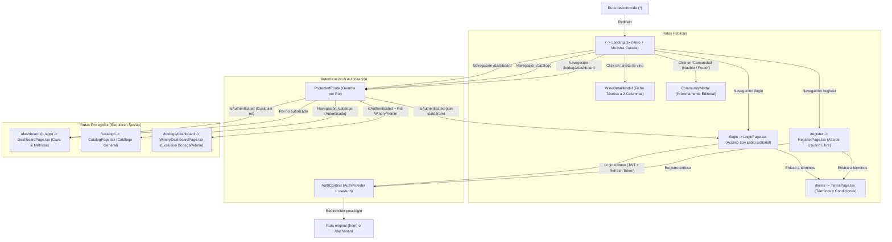

# Mapa de Navegación y Flujo de Usuario - AyVino Frontend

Este documento detalla la arquitectura de información, las vistas de la aplicación, el sistema de rutas protegidas y la experiencia interactiva (UX) del usuario en la SPA de AyVino.

---

## 1. Diagrama de Navegación y Guardias de Ruta

---

## 2. Pantallas y Componentes Interactivos

### 2.1 Página de Inicio (`Landing.tsx`)
- **Estética Editorial de Cava Oscura (`#0f0f11` / `#141416`)**:
  - Fondo general carbón mate `#0f0f11`, eliminando fondos claros y sombras difusas.
  - Botones principales en bordó sólido `#6b1d28` (hover `#7e2432`) y secundarios outlined sobrios (`border-neutral-700 text-neutral-200`).
  - Metadatos técnicos, chips de categoría y procedencia en tipografía `font-mono tracking-widest text-[11px]`.
- **Sección Hero**:
  - Título editorial de alto impacto (*"Descorchá nuevas historias, coleccioná cada copa"* en `font-sans` + `font-serif`).
  - Eyebrow tipográfico plano (`font-mono text-[10px] tracking-[0.25em] uppercase text-neutral-400 font-medium`) sin píldoras animadas.
  - Acciones rápidas para explorar la selección curada o crear cuenta.
  - Botella interactiva con perspectiva pseudo-3D integrada armónicamente sobre el fondo oscuro ([`WineBottleMock.tsx`](../../src/frontend/src/features/wines/components/WineBottleMock.tsx)).
- **Grilla de Vinos Curados**:
  - Renderizado de tarjetas de vino ([`WineCard.tsx`](../../src/frontend/src/features/wines/components/WineCard.tsx)) en contenedores `#141416` con bordes estructurales `border-neutral-800` en diseño a dos columnas.
  - **Minimalismo y escaneo visual rápido**: contiene únicamente silueta/foto de botella, varietal y añada (`font-mono`), nombre y bodega, calificación con cantidad de notas y botón sobrio *"Ver ficha"*. Totalmente libre de precios y descripciones redundantes.
- **Modal de Ficha Técnica** ([`WineDetailModal.tsx`](../../src/frontend/src/features/wines/components/WineDetailModal.tsx)):
  - Estructura a dos columnas: columna izquierda con escaparate de botella (foto o [`WineBottleSilhouette.tsx`](../../src/frontend/src/features/wines/components/WineBottleSilhouette.tsx)) y columna derecha con ficha técnica exhaustiva.
  - Desglose sensorial y técnico: puntaje, añada, crianza, notas de cata y aromas (copywriting cercano), descriptores, maridaje y origen/altura. Sin precios.
- **Modal de Comunidad** ([`CommunityModal.tsx`](../../src/frontend/src/components/community/CommunityModal.tsx)):
  - Modal sobrio de *"Próximamente"* activado desde el Navbar y el pie de página.
  - Titular en Serif noble, gráfico minimalista SVG en trazo fino (copas y mesa de cata) y texto explicativo sobre catas compartidas y clubes enológicos locales.

### 2.2 Pantalla de Inicio de Sesión (`LoginPage.tsx`) y Registro (`RegisterPage.tsx`)
- Vistas dedicadas (`/login` y `/register`) con layout split-card sobrio, equilibrado y sin scroll:
  - **Viewport**: Contenedor controlado sin scroll vertical (`h-screen overflow-hidden flex items-center justify-center p-4 bg-[#0e0e11]`).
  - **Tarjeta Central (Split Card)**: Altura contenida en desktop (`h-[88vh] max-h-[640px] w-full max-w-5xl`), esquinas redondeadas (`rounded-3xl`), desbordamiento oculto (`overflow-hidden`), sombra profunda (`shadow-2xl shadow-black/80`), borde sutil (`border border-white/10`) y grilla responsive a 2 columnas (`grid-cols-1 lg:grid-cols-2`).
  - **Columna Izquierda (Formulario)**:
    - Fondo oscuro grafito (`bg-[#141416]`) con distribución equilibrada (`p-8 md:p-10 flex flex-col justify-between h-full`).
    - Encabezado superior invertido: enlace de retorno `← Volver` a la izquierda y marca/isotipo de `AyVino` a la derecha.
    - Cabecera editorial con tags de colección (`"Colección Privada"` en Login y `"Membresía"` en Registro, `text-[10px] uppercase tracking-[0.25em] text-amber-200/60`), título destacado en tipografía Serif clásica (`font-serif text-3xl text-zinc-100 font-normal tracking-tight`, *"Bienvenido de nuevo"* en Login y *"Creá tu bodega personal"* en Registro) y subtítulo editorial descriptivo (`text-xs text-zinc-400 mt-2 font-sans font-light`).
    - **Validación Frontend Reactiva (sin popups del navegador)**:
      * Formulario configurado con `<form noValidate onSubmit={handleSubmit}>` para silenciar tooltips nativos.
      * Estado reactivo local de errores (`errors: Record<string, string>`) que valida campos obligatorios en el submit (`.trim()`).
      * En Registro: valida `name` (mapeado a `username`), `email`, `password` (mínimo 8 caracteres exigido por el backend), `confirmPassword`, coincidencia exacta de contraseñas y aceptación de términos.
      * Conexión persistente: invoca `registerApi` (`POST /api/users`) seguido de `loginApi` (`POST /api/auth/login`) para emisión de JWT real, sin depender de mocks ni demos en memoria.
      * Feedback visual contextual y sutil: borde rojizo `border-rose-500/70 focus:border-rose-500`, alerta de servidor ante conflictos (409) o desconexión, y mensaje discreto debajo de cada campo (`text-[10px] text-rose-400 mt-1 pl-1`).
      * Limpieza instantánea del error en el evento `onChange` al reanudar la escritura.
    - **Estilo de Inputs Clean Dark (Minimalista sin etiquetas externas)**: Solo cajón con placeholder descriptivo interior (`h-12 w-full rounded-xl px-4 text-sm font-sans bg-zinc-900/50 hover:bg-zinc-900/70 border border-zinc-800/80 focus:border-zinc-500 focus:bg-zinc-900 text-zinc-100 placeholder:text-zinc-500 transition-colors`).
    - Campos de contraseña interactivos con botón toggle sutil de ver/ocultar clave integrado a la derecha (`pr-11`, `Eye` / `EyeOff` en `text-zinc-500 hover:text-zinc-300`).
    - Botón de submit primario estilo sello de cava con curvas uniformes (`h-12 w-full rounded-xl bg-[#4f131f] hover:bg-[#5e1725] border border-rose-400/20 text-xs uppercase tracking-widest text-rose-100 font-medium transition-colors shadow-sm mt-2` con *"Iniciar sesión"* en Login y *"Crear cuenta"* en Register).
    - Footer inferior fijo abajo: enlace sobrio para alternar entre Iniciar Sesión y Crear Cuenta (sin botones demo ni texto legal redundante).
  - **Columna Derecha (Foto Vertical con Fusión Orgánica)**:
    - Oculta en móviles y visible en desktop (`hidden lg:flex h-full`).
    - Fotografía vertical nativa WebP de viñedos y cordillera (`auth-vineyard.webp`, `w-full h-full object-cover object-center`).
    - Tinte suave `bg-black/20`, capa superpuesta con degradado hacia el borde izquierdo (`bg-gradient-to-r from-[#141416] via-transparent to-transparent`) para fundirse armónicamente con la columna del formulario, y sutil degradado inferior `bg-gradient-to-t from-black/70 via-transparent to-transparent`.
    - Sin cajas ni contenedores artificiales: texto tipográfico plano en la parte inferior *"VALLE DE UCO · MENDOZA"* (`text-xs tracking-[0.3em] text-white/80 font-light uppercase`).

### 2.3 Pantalla Provisional de Términos y Condiciones (`TermsPage.tsx`)
- Vista pública accesible en `/terms` con estética editorial de cava oscura (`min-h-screen bg-[#0e0e11] text-zinc-100 flex flex-col items-center justify-center p-6`):
  - Tarjeta central flotante en `bg-zinc-900 border border-white/10 rounded-3xl p-8 md:p-10`.
  - Botón de navegación `← Volver` con retorno inteligente (`history.back()` o redirección al home).
  - Título en Serif noble (*"Términos y Condiciones"*) y mensaje explicativo de disponibilidad próxima.
  - Accesible desde los enlaces integrados en los formularios de autenticación (`/register` y `/login`).

### 2.4 Homepage / Dashboard Autenticado (`DashboardPage.tsx`)
- Vista post-login accesible en `/dashboard` (y alias `/app`):
  - **Barra de Navegación del Dashboard (`DashboardNavbar.tsx`)**:
    - Logotipo e isotipo oficial de AyVino / MiCava.
    - Enlaces a Explorar, Mi Cava (con contador dinámico), Historial, Maridaje y Deseados.
    - Selector interactivo de ubicación/cava (*Casa Principal*, *Departamento*, *Casa de campo*).
    - Menú desplegable con avatar del usuario, rol activo y botón de salida (*logout*) que redirige a `/` con `{ replace: true }`.
  - **Acciones Rápidas (`QuickActions.tsx`)**:
    - Saludo dinámico según horario (*"Buenas noches, [Nombre]. ¿Qué vamos a descorchar hoy?"*).
    - Barra de búsqueda y botón *"Registrar botella"*.
  - **Sección Mi Cava (`DashboardSection.tsx`)**:
    - Conmutador de vista: *"Con Stock"* vs *"Usuario Nuevo"*.
    - **Métricas (`Metrics.tsx`)**: botellas en cava, catados en historial, lista de deseos y ubicaciones.
    - **Carrusel de Consumo Óptimo (`StockCarousel.tsx`)**: botellas listas para descorchar, navegación horizontal y tarjetas con badges.
    - **Diálogo de Descorche (`UncorkDialog.tsx`)**: calificación interactiva en estrellas (1-5), ocasión de consumo y notas de cata.
  - **Bloques Promocionales y de Maridaje (`PromoBlocks.tsx`)**: selecciones destacadas de tintos y blancos de altura.
  - **Catálogo por Bodegas (`FilterChips.tsx` y `WineryBlock.tsx`)**:
    - Filtros rápidos por cepa y región (Malbec, Cabernet, Blancos, Mendoza, Salta, Patagonia).
    - Agrupación por bodega (*Catena Zapata*, *Zuccardi*) con monograma circular y botón *"Añadir a Cava"*.

### 2.5 Barra de Navegación Contextual (`Navbar.tsx`)
- Barra superior con diseño de cava oscura (`bg-[#0f0f11]/90 border-b border-neutral-800 text-neutral-200`) y tipografía `font-mono`:
  - **Estado Anónimo**: Exhibe enlaces de sección y accesos a *"Iniciar Sesión"* (`/login`) y *"Crear Cuenta"* (`/register`).
  - **Estado Autenticado**:
    - Enlace destacado a **Mi Cava** (`/dashboard`).
    - Enlace al Catálogo Protegido (`/catalogo`).
    - Enlace al Panel de Bodega (`/bodega/dashboard`) únicamente visible para roles `Winery` y `Admin`.
    - Píldora con nombre de usuario y badge de rol (`User`, `Winery`, `Admin`).
    - Botón de cierre de sesión (*"Salir"*) con llamada a `logout()` y redirección inmediata a `/` (`navigate('/', { replace: true })`).

---

## 3. Vistas Protegidas y Políticas de Acceso

| Ruta | Componente | Acceso Permitido | Comportamiento si no cumple |
| :--- | :--- | :--- | :--- |
| `/` | `Landing.tsx` | Público (todos) | N/A |
| `/login` | `LoginPage.tsx` | Público (redirige a `state.from` o `/dashboard` si ya está autenticado) | N/A |
| `/register` | `RegisterPage.tsx` | Público (redirige a `/dashboard` si ya está autenticado) | N/A |
| `/terms` | `TermsPage.tsx` | Público (todos) | N/A |
| `/dashboard` | `DashboardPage.tsx` | Autenticado (`User`, `Winery`, `Admin`) | Redirige a `/login` pasando `{ from: location }` |
| `/app` | Alias Redirección | Redirige automáticamente a `/dashboard` | N/A |
| `/catalogo` | `CatalogPage.tsx` | Autenticado (`User`, `Winery`, `Admin`) | Redirige a `/login` pasando `{ from: location }` |
| `/bodega/dashboard` | `WineryDashboardPage.tsx` | Exclusivo `Winery` o `Admin` | Si no está autenticado: `/login` (`state.from`). Si no tiene rol: `/dashboard` |
| `*` | Redirección 404 | N/A | Redirige automáticamente a `/` |
