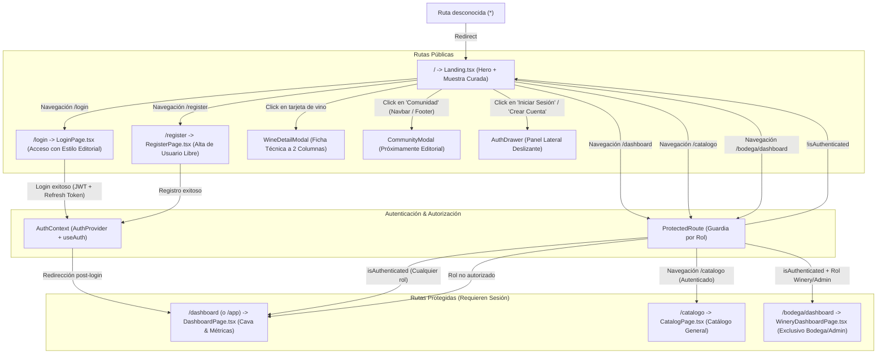

# Mapa de Navegación y Flujo de Usuario - AyVino Frontend

Este documento detalla la arquitectura de información, las vistas de la aplicación, el sistema de rutas protegidas y la experiencia interactiva (UX) del usuario en la SPA de AyVino.

---

## 1. Diagrama de Navegación y Guardias de Ruta

---

## 2. Pantallas y Componentes Interactivos

### 2.1 Página de Inicio (`Landing.tsx`)
- **Estética Editorial de Cava Oscura (`#0f0f11` / `#141416`)**:
  - Fondo general carbón mate `#0f0f11`, eliminando fondos claros y sombras difusas.
  - Botones principales en bordó sólido `#6b1d28` (hover `#7e2432`) y secundarios outlined sobrios (`border-neutral-700 text-neutral-200`).
  - Metadatos técnicos, chips de categoría y procedencia en tipografía `font-mono tracking-widest text-[11px]`.
- **Sección Hero**:
  - Título editorial de alto impacto (*"Descorchá nuevas historias, coleccioná cada copa"* en `font-sans` + `font-serif`).
  - Eyebrow tipográfico plano (`font-mono text-[10px] tracking-[0.25em] uppercase text-neutral-400 font-medium`) sin píldoras animadas.
  - Acciones rápidas para explorar la selección curada o crear cuenta.
  - Botella interactiva con perspectiva pseudo-3D integrada armónicamente sobre el fondo oscuro ([`WineBottleMock.tsx`](../../src/frontend/src/features/wines/components/WineBottleMock.tsx)).
- **Grilla de Vinos Curados**:
  - Renderizado de tarjetas de vino ([`WineCard.tsx`](../../src/frontend/src/features/wines/components/WineCard.tsx)) en contenedores `#141416` con bordes estructurales `border-neutral-800` en diseño a dos columnas.
  - **Minimalismo y escaneo visual rápido**: contiene únicamente silueta/foto de botella, varietal y añada (`font-mono`), nombre y bodega, calificación con cantidad de notas y botón sobrio *"Ver ficha"*. Totalmente libre de precios y descripciones redundantes.
- **Modal de Ficha Técnica** ([`WineDetailModal.tsx`](../../src/frontend/src/features/wines/components/WineDetailModal.tsx)):
  - Estructura a dos columnas: columna izquierda con escaparate de botella (foto o [`WineBottleSilhouette.tsx`](../../src/frontend/src/features/wines/components/WineBottleSilhouette.tsx)) y columna derecha con ficha técnica exhaustiva.
  - Desglose sensorial y técnico: puntaje, añada, crianza, notas de cata y aromas (copywriting cercano), descriptores, maridaje y origen/altura. Sin precios.
- **Modal de Comunidad** ([`CommunityModal.tsx`](../../src/frontend/src/components/community/CommunityModal.tsx)):
  - Modal sobrio de *"Próximamente"* activado desde el Navbar y el pie de página.
  - Titular en Serif noble, gráfico minimalista SVG en trazo fino (copas y mesa de cata) y texto explicativo sobre catas compartidas y clubes enológicos locales.

### 2.2 Pantalla de Inicio de Sesión (`LoginPage.tsx`) y Registro (`RegisterPage.tsx`)
- Vistas dedicadas (`/login` y `/register`) con la identidad editorial de cava oscura de AyVino:
  - Fondo completo en `bg-[#0f0f11]`, contenedores sobrios `#141416` con bordes de 1px `border-neutral-800` y radios mínimos (`rounded-sm`).
  - Inputs estructurados (`bg-[#18181b] border-neutral-700 text-neutral-100 placeholder:text-neutral-500 focus:border-[#6b1d28] focus:ring-0`).
  - Botón de submit principal en bordó sólido `bg-[#6b1d28] hover:bg-[#7e2432] text-white tracking-wider uppercase text-xs font-semibold py-3`.
  - Botón de *"Acceso Rápido Demo / Desarrollador"* sobrio en `border-neutral-800 bg-neutral-900/40 text-neutral-300 hover:border-neutral-600`.
  - Manejo de errores tipados y feedback accesible.

### 2.3 Homepage / Dashboard Autenticado (`DashboardPage.tsx`)
- Vista post-login accesible en `/dashboard` (y alias `/app`):
  - **Barra de Navegación del Dashboard (`DashboardNavbar.tsx`)**:
    - Logotipo e isotipo oficial de AyVino / MiCava.
    - Enlaces a Explorar, Mi Cava (con contador dinámico), Historial, Maridaje y Deseados.
    - Selector interactivo de ubicación/cava (*Casa Principal*, *Departamento*, *Casa de campo*).
    - Menú desplegable con avatar del usuario, rol activo y botón de salida (*logout*) que redirige a `/` con `{ replace: true }`.
  - **Acciones Rápidas (`QuickActions.tsx`)**:
    - Saludo dinámico según horario (*"Buenas noches, [Nombre]. ¿Qué vamos a descorchar hoy?"*).
    - Barra de búsqueda y botón *"Registrar botella"*.
  - **Sección Mi Cava (`DashboardSection.tsx`)**:
    - Conmutador de vista: *"Con Stock"* vs *"Usuario Nuevo"*.
    - **Métricas (`Metrics.tsx`)**: botellas en cava, catados en historial, lista de deseos y ubicaciones.
    - **Carrusel de Consumo Óptimo (`StockCarousel.tsx`)**: botellas listas para descorchar, navegación horizontal y tarjetas con badges.
    - **Diálogo de Descorche (`UncorkDialog.tsx`)**: calificación interactiva en estrellas (1-5), ocasión de consumo y notas de cata.
  - **Bloques Promocionales y de Maridaje (`PromoBlocks.tsx`)**: selecciones destacadas de tintos y blancos de altura.
  - **Catálogo por Bodegas (`FilterChips.tsx` y `WineryBlock.tsx`)**:
    - Filtros rápidos por cepa y región (Malbec, Cabernet, Blancos, Mendoza, Salta, Patagonia).
    - Agrupación por bodega (*Catena Zapata*, *Zuccardi*) con monograma circular y botón *"Añadir a Cava"*.

### 2.4 Barra de Navegación Contextual (`Navbar.tsx`)
- Barra superior con diseño de cava oscura (`bg-[#0f0f11]/90 border-b border-neutral-800 text-neutral-200`) y tipografía `font-mono`:
  - **Estado Anónimo**: Exhibe enlaces de sección y accesos a *"Iniciar Sesión"* (`/login`) y *"Crear Cuenta"* (`/register`).
  - **Estado Autenticado**:
    - Enlace destacado a **Mi Cava** (`/dashboard`).
    - Enlace al Catálogo Protegido (`/catalogo`).
    - Enlace al Panel de Bodega (`/bodega/dashboard`) únicamente visible para roles `Winery` y `Admin`.
    - Píldora con nombre de usuario y badge de rol (`User`, `Winery`, `Admin`).
    - Botón de cierre de sesión (*"Salir"*) con llamada a `logout()` y redirección inmediata a `/` (`navigate('/', { replace: true })`).

---

## 3. Vistas Protegidas y Políticas de Acceso

| Ruta | Componente | Acceso Permitido | Comportamiento si no cumple |
| :--- | :--- | :--- | :--- |
| `/` | `Landing.tsx` | Público (todos) | N/A |
| `/login` | `LoginPage.tsx` | Público (redirige a `/dashboard` si ya está autenticado) | N/A |
| `/register` | `RegisterPage.tsx` | Público (redirige a `/dashboard` si ya está autenticado) | N/A |
| `/dashboard` | `DashboardPage.tsx` | Autenticado (`User`, `Winery`, `Admin`) | Redirige a `/` |
| `/app` | Alias Redirección | Redirige automáticamente a `/dashboard` | N/A |
| `/catalogo` | `CatalogPage.tsx` | Autenticado (`User`, `Winery`, `Admin`) | Redirige a `/` |
| `/bodega/dashboard` | `WineryDashboardPage.tsx` | Exclusivo `Winery` o `Admin` | Redirige a `/dashboard` |
| `*` | Redirección 404 | N/A | Redirige automáticamente a `/` |
