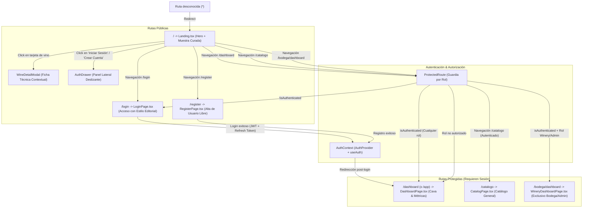

# Mapa de Navegación y Flujo de Usuario - AyVino Frontend

Este documento detalla la arquitectura de información, las vistas de la aplicación, el sistema de rutas protegidas y la experiencia interactiva (UX) del usuario en la SPA de AyVino.

---

## 1. Diagrama de Navegación y Guardias de Ruta

---

## 2. Pantallas y Componentes Interactivos

### 2.1 Página de Inicio (`Landing.tsx`)
- **Sección Hero**:
  - Título editorial de alto impacto (*"Tu bodega personal, organizada copa a copa"*).
  - Acciones rápidas para explorar la selección curada o ingresar al sistema.
- **Grilla de Vinos Curados**:
  - Renderizado de tarjetas de vino ([`WineCard.tsx`](../../src/frontend/src/features/wines/components/WineCard.tsx)).
  - Badges de puntuación, notas de cata sensoriales, procedencia (*"Oficial"* vs *"Comunidad"*) y precio orientativo.
- **Modal de Ficha Técnica** ([`WineDetailModal.tsx`](../../src/frontend/src/features/wines/components/WineDetailModal.tsx)):
  - Visualización 3D simulada de la botella ([`WineBottleMock.tsx`](../../src/frontend/src/features/wines/components/WineBottleMock.tsx)).
  - Desglose técnico: añada, notas de cata completas, maridajes y características de terroir.

### 2.2 Pantallas de Autenticación Integradas (`LoginPage.tsx` y `RegisterPage.tsx`)
- Vistas completas (`/login` y `/register`) con la identidad editorial de AyVino:
  - Fondos cálidos pergamino (`bg-cream-50`), tarjetas blancas con bordes tenues (`border-cream-200`).
  - Inputs con esquinas redondeadas (`rounded-xl`), fondo limpio y focos en borgoña (`focus:border-wine-800`).
  - Botones principales de acción tipo píldora (`rounded-full bg-wine-900 text-cream-50`).
  - Feedback visual de carga y manejo de errores tipados.

### 2.3 Homepage / Dashboard Autenticado (`DashboardPage.tsx`)
- Vista post-login accesible en `/dashboard` (y alias `/app`):
  - **Barra de Navegación del Dashboard (`DashboardNavbar.tsx`)**:
    - Logotipo e isotipo oficial de AyVino (sustituyendo MiCava).
    - Enlaces a Explorar, Mi Cava (con contador dinámico), Historial, Maridaje y Deseados.
    - Selector interactivo de ubicación/cava (*Casa Principal*, *Departamento*, *Casa de campo*).
    - Menú desplegable con avatar del usuario, rol activo y botón de salida (*logout*).
  - **Acciones Rápidas (`QuickActions.tsx`)**:
    - Saludo dinámico según horario (*"Buenas noches, [Nombre]. ¿Qué vamos a descorchar hoy?"*).
    - Barra de búsqueda píldora (`rounded-full`) y botón *"Registrar botella"*.
  - **Sección Mi Cava (`DashboardSection.tsx`)**:
    - Conmutador de vista: *"Con Stock"* vs *"Usuario Nuevo"*.
    - **Métricas (`Metrics.tsx`)**: botellas en cava, catados en historial, lista de deseos y ubicaciones.
    - **Carrusel de Consumo Óptimo (`StockCarousel.tsx`)**: botellas listas para descorchar, navegación horizontal y tarjetas con badges.
    - **Diálogo de Descorche (`UncorkDialog.tsx`)**: calificación interactiva en estrellas (1-5), ocasión de consumo y notas de cata.
    - **Banner de Incorporación (`OnboardingBanner.tsx`)**: guía en 3 pasos para nuevos sommeliers.
  - **Bloques Promocionales y de Maridaje (`PromoBlocks.tsx`)**: selecciones destacadas de tintos y blancos de altura.
  - **Catálogo por Bodegas (`FilterChips.tsx` y `WineryBlock.tsx`)**:
    - Filtros rápidos por cepa y región (Malbec, Cabernet, Blancos, Mendoza, Salta, Patagonia).
    - Agrupación por bodega (*Catena Zapata*, *Zuccardi*) con monograma circular y botón *"Añadir a Cava"*.

### 2.4 Barra de Navegación Contextual (`Navbar.tsx`)
- Integración con React Router (`<Link>`) y reactiva al estado global de [`useAuth()`](../../src/frontend/src/features/auth/context/AuthContext.tsx):
  - **Estado Anónimo**: Exhibe enlaces de sección y botones *"Iniciar Sesión"* (`/login`) y *"Crear Cuenta"* (`/register`).
  - **Estado Autenticado**:
    - Enlace destacado a **Mi Cava** (`/dashboard`).
    - Enlace al Catálogo Protegido (`/catalogo`).
    - Enlace al Panel de Bodega (`/bodega/dashboard`) únicamente visible para roles `Winery` y `Admin`.
    - Píldora con nombre de usuario y badge de rol (`User`, `Winery`, `Admin`).
    - Botón de cierre de sesión (*"Salir"* / *"Cerrar Sesión"*).

---

## 3. Vistas Protegidas y Políticas de Acceso

| Ruta | Componente | Acceso Permitido | Comportamiento si no cumple |
| :--- | :--- | :--- | :--- |
| `/` | `Landing.tsx` | Público (todos) | N/A |
| `/login` | `LoginPage.tsx` | Público (redirige a `/dashboard` si ya está autenticado) | N/A |
| `/register` | `RegisterPage.tsx` | Público (redirige a `/dashboard` si ya está autenticado) | N/A |
| `/dashboard` | `DashboardPage.tsx` | Autenticado (`User`, `Winery`, `Admin`) | Redirige a `/login` |
| `/app` | Alias Redirección | Redirige automáticamente a `/dashboard` | N/A |
| `/catalogo` | `CatalogPage.tsx` | Autenticado (`User`, `Winery`, `Admin`) | Redirige a `/login` |
| `/bodega/dashboard` | `WineryDashboardPage.tsx` | Exclusivo `Winery` o `Admin` | Redirige a `/dashboard` |
| `*` | Redirección 404 | N/A | Redirige automáticamente a `/` |
